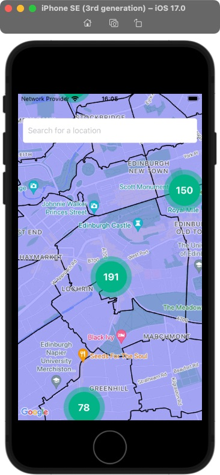

# Smart Park

## Summary
iOS app that shows bicycle and car parking information for Edinburgh

## Description
The Edinburgh City Council has parking information up on the council website but this is not very easy to find or accessible. We wanted to proovide an easy app that would show parking spots and their costs and relevant information, but also show bicyle parking spots to promote cycling instead of taking the car. 

## Technical Architecture:
The app is based on a data layer (ParkingData) that pocesses the data, a web server layer (ParkingServer) to serve out this data and the actual Smart Park iOS app.  The data layer is built in python and uses a Postgresql database. The webserver is built in Java Spring. The iOS app is built in React Native and uses Google maps. 

### Requirements:
To be able to run the entire project the following will need to be installed on your machine:
- Python 3.11 
- SQLAlchemy 2.0.20
- PyMongo 4.6.0
- MongoDB 6.0.10 Community
- PostgresQL 14.10
- Java 17
- Spring 3.1.6 (*Spring Web*, *Spring Boot DevTools*, *Spring Data JPA*, *PostgresSQL Driver*)
- Xcode
- Expo Go *on your phone*
    

## Installation Instructions:
1.  ParkingData needs to be installed first. Please follow the detailed instructions from the [Readme]  (https://github.com/LidzDev/ParkingData/Readme.md)
2. ParkingServer needs to be installed next. Please follow the detailed instructions from the [Readme]  (https://github.com/Andy-brown87/ParkingServer/Readme.md)
3. Finally install the app. Please follow the detailed instructions from the [Readme] (https://github.com/DarrenLackie/parking_app_frontend/Readme.md)
     
## How to use it

1. Make sure the parking database is running and that you have ran the seed scripts. You can use a tool like [postico](https://eggerapps.at/postico2/). You should see some tables with data in the parking database called:
    `bicycle_spots, hours, parking_spots, parking_zones, spot_coordinates, vehicles, zone_coordinates`
2. Make sure the webserver is installed and running on port 8080. You can use a tool like [insomnia](https://insomnia.rest/products/insomnia). You should get some results when you [check](http://localhost:8080/parkingspots)
3. Make sure the front end client is running

## What it looks like

### Credits 

- [Claire Martin] (https://github.com/cemmartin)
- [Darren Lackie] (https://github.com/DarrenLackie)
- [Lydia Cordell] (https://github.com/LidzDev)
- [Andrew Brown] (https://github.com/andy-brown87)
